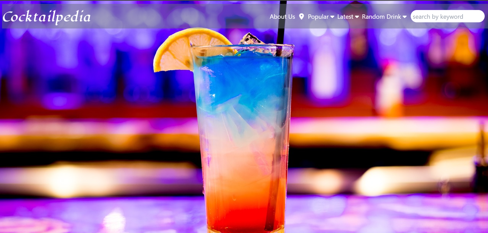

# Cocktailpedia
Introducing our innovative website that simplifies the process of discovering delicious drinks! Whether you're struggling to come up with a refreshing beverage or looking for new ideas, our platform has got you covered.

With just a few words, you can easily search for drinks that match your preferences. For example, if you type "beer," our website will instantly provide a curated list of drinks along with detailed information, instructions, and a list of ingredients for each one.

But that's not all! We offer additional features to enhance your drink exploration experience. You can explore the most popular drinks, discover the latest trends, or simply let serendipity guide you by using our random drink generator.

No more hassle in looking up drink recipes or feeling stuck when deciding what to enjoy. Our user-friendly website is designed to make your drink quest a breeze, ensuring you always have the perfect drink at your fingertips. Cheers to hassle-free drink discovery!

## Website Link 
https://ch40s1.github.io/Cocktail-pedia/

## Table of Contents
* [Usage](#usage)
* [Credits](#credits)
* [Collaborators](#collaborators)
* [License](#license)
* [Features](#features)

### To contribute
1. Make a clone or fork the repository
2. Make a new branch 
3. Use prefered IDE submit changes.

## Website Image  

  

## Usage
This application allows for simple keyword searches. One does not need to know the drink name. Searching the drinks will provide with some info on the drink. 
There are several options, either choose from our popular, latest selection or choose a random drink that refreshes when the site is refreshed.  
The site also has a map that allows for a city search. It will display bard and pub locations around the location.
## Credits
MDN web docs:
https://developer.mozilla.org/en-US/docs/Learn

javaScriptInfo: 
https://javascript.info/

font-is-awsome/icons
https://fontawesome.com/

Jon and Cameron
Bootcamp instructor and teacher assistant

thecocktaildb/drink api
https://www.thecocktaildb.com/
(credit to the creator for this api. Note: patreon is needed)

openstreetmap api
https://wiki.openstreetmap.org/wiki/API

tailwind/docs
https://tailwindcss.com/docs/installation

## Collaborators
<strong>Sarah</strong>: javascript, she provided the paid api for the drinks  
<strong>Elizabeth Weatherby</strong> : javascript and html, made the modals and managed the repository  
<strong>Cryslin W</strong>: made the about us html  
<strong>Daniel Z (ME, Github: Ch40s1)</strong> html,css,javascript.   

## License
MIT license

## Features
Made with HTMl, CSS, Javascript, and Tailwind css. 
Uses openstreetmap api and thecocktaildb api